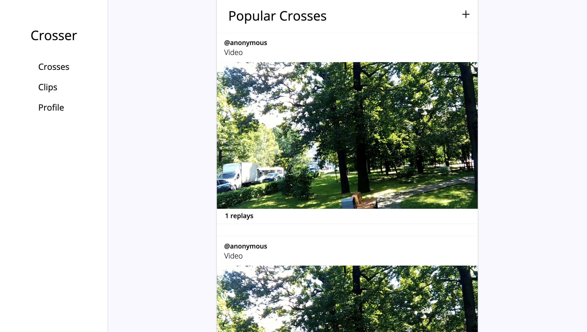

# Project One

A prototype I developed using Media Source Extensions. The idea is that users upload clips which others can then combine to make "crosses". I have shut down the API and all other cloud resources so this project is no longer functional.

